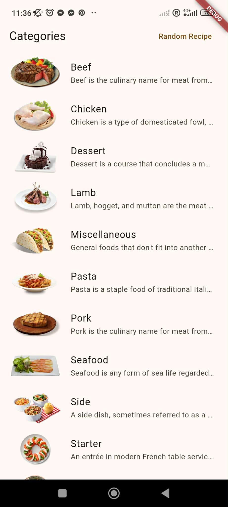
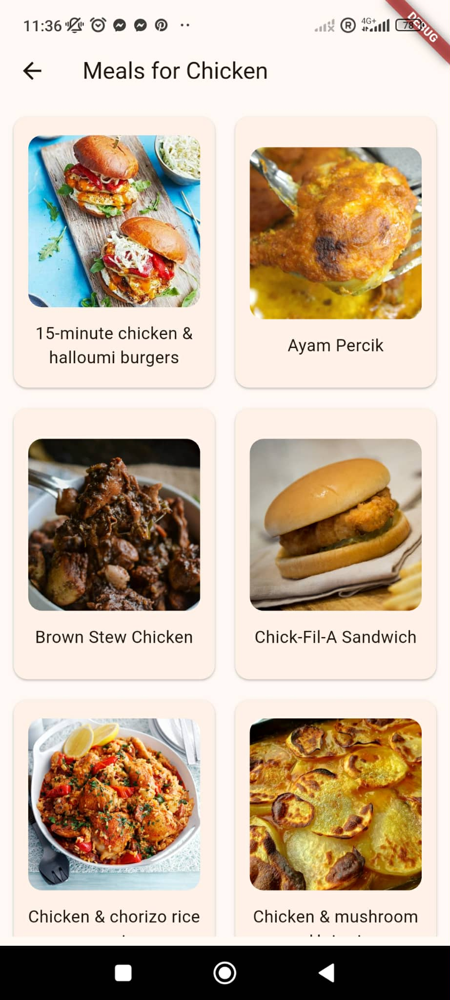
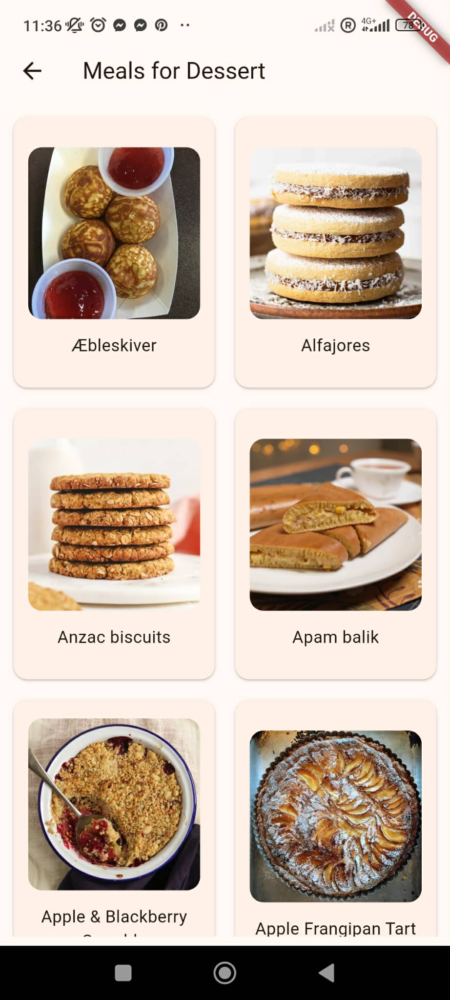
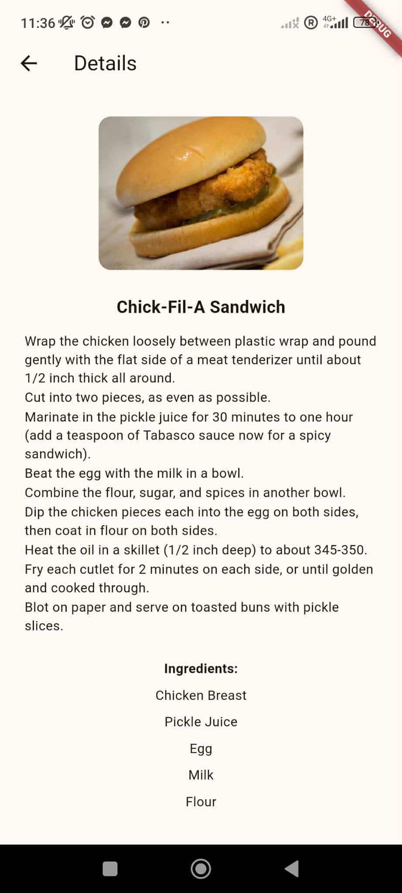
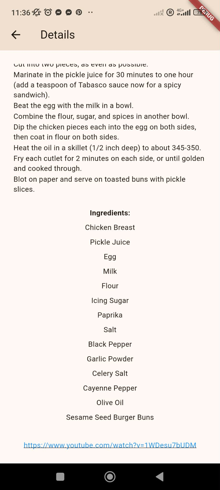
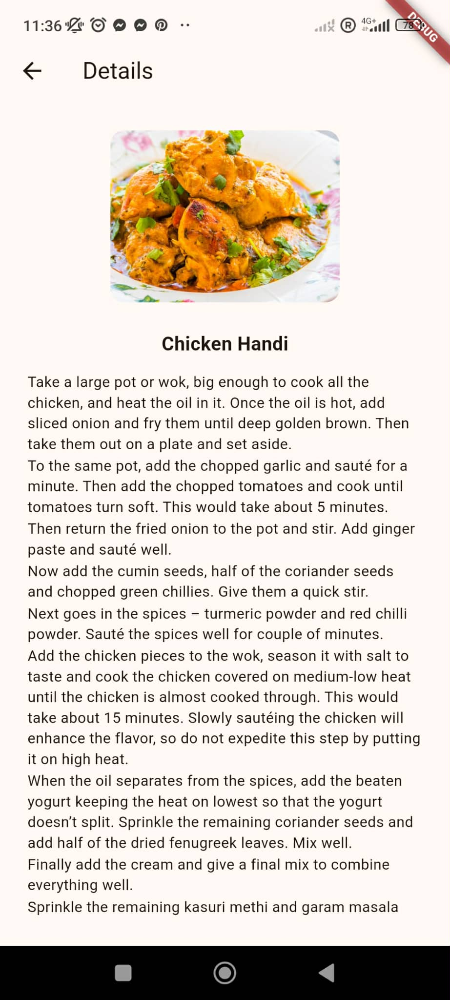
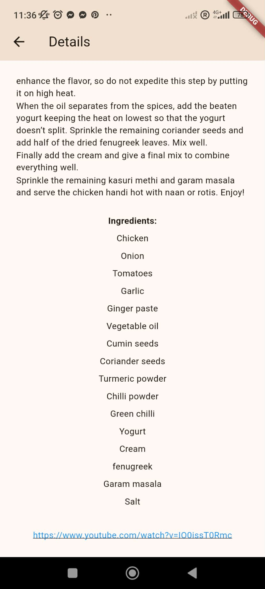
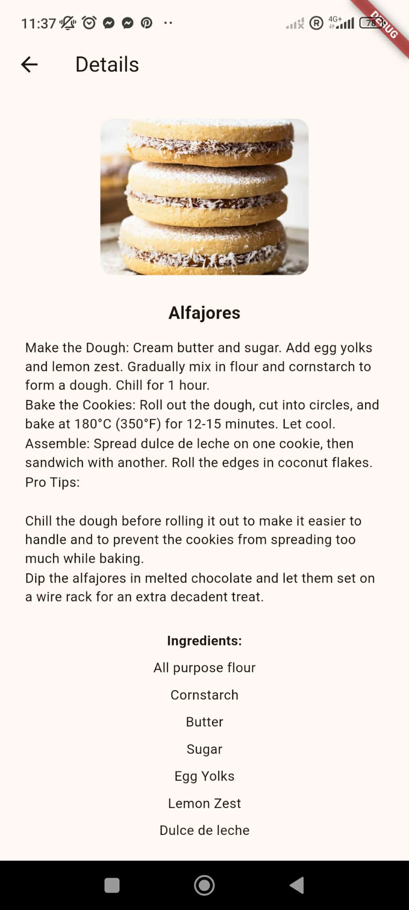

# lab2_mis

A new Flutter project.

## Getting Started

Screenshot 1: (Home page, categories)

Screenshot 2: (Meals for selected category)

Screenshot 3: (Meals for selected category)

Screenshot 4: (Single meal recipe)

Screenshot 5: (Single meal recipe)

Screenshot 6: (Single meal recipe)

Screenshot 7: (Single meal recipe)

Screenshot 8: (Random meal recipe of the day)

